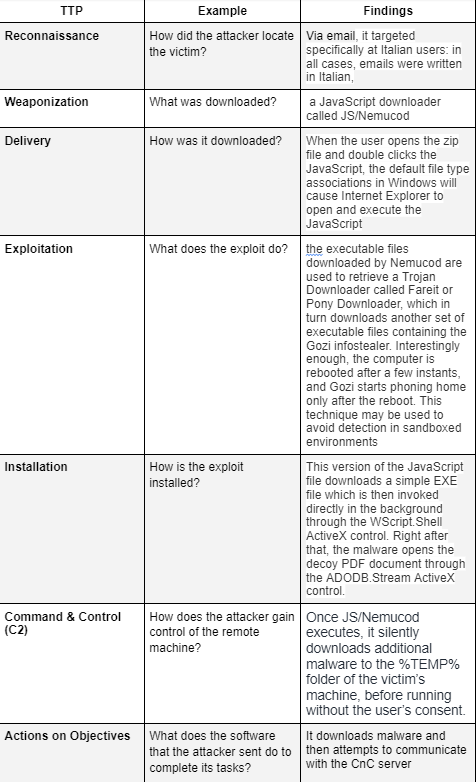

A Network Security Demonstration
By: Chad Lund
Security Control Types

##The concept of defense in depth can be broken down into three security control types.

Walls, bollards, fences, guard dogs, cameras, and lighting.

    Physical Security

Security awareness programs, BYOD policies, and ethical hiring practices.

    Administrative

Encryption, biometric fingerprint readers, firewalls, endpoint security, and intrusion detection systems.

    Technical

##Intrusion Detection and Attack Indicators

Difference between an IDS and an IPS.

IDS monitors traffic on the network, analyzes for possible attacks, and alerts and logs when something suspicious happens. An IPS monitors traffic as well but it is also a reactive safety measure that will stop incoming traffic

Difference between an indicator of attack (IOA) and an indicator of compromise (IOC).

An IOA is a possible intrusion attempt that was not successful and an IOC is a possible intrusion attempt that was successful

##The Cyber Kill Chain

The seven stages of the cyber kill chain, and a brief example of each.

Stage 1: 

Reconnaissance
Reconnaissance is the first stage in the Cyber Kill Chain and involves researching potential targets before carrying out any penetration testing. The reconnaissance stage may include identifying potential targets, finding their vulnerabilities, discovering which third parties are connected to them (and what data they can access), and exploring existing entry points as well as finding new ones. Reconnaissance can take place both online and offline.

Stage 2:

Weaponization
The weaponization stage of the Cyber Kill Chain occurs after reconnaissance has taken place and the attacker has discovered all necessary information about potential targets, such as vulnerabilities. In the weaponization stage, all of the attacker’s preparatory work culminates in the creation of malware to be used against an identified target. Weaponization can include creating new types of malware or modifying existing tools to use in a cyberattack. For example, cybercriminals may make minor modifications to an existing ransomware variant to create a new Cyber Kill Chain tool.

Stage 3:

Delivery
In the delivery stage, cyberweapons and other Cyber Kill Chain tools are used to infiltrate a target’s network and reach users. Delivery may involve sending phishing emails containing malware attachments with subject lines that prompt users to click through. Delivery can also take the form of hacking into an organization’s network and exploiting a hardware or software vulnerability to infiltrate it.

Stage 4:

Exploitation
Exploitation is the stage that follows delivery and weaponization. In the exploitation step of the Cyber Kill Chain, attackers take advantage of the vulnerabilities they have discovered in previous stages to further infiltrate a target’s network and achieve their objectives. In this process, cybercriminals often move laterally across a network to reach their targets. Exploitation can sometimes lead attackers to their targets if those responsible for the network have not deployed deception measures.

Stage 5:

Installation
After cybercriminals have exploited their target’s vulnerabilities to gain access to a network, they begin the installation stage of the Cyber Kill Chain: attempting to install malware and other cyberweapons onto the target network to take control of its systems and exfiltrate valuable data. In this step, cybercriminals may install cyberweapons and malware using Trojan horses, backdoors, or command-line interfaces.

Stage 6:
Command and Control
In the C2 stage of the Cyber Kill Chain, cybercriminals communicate with the malware they’ve installed onto a target’s network to instruct cyberweapons or tools to carry out their objectives. For example, attackers may use communication channels to direct computers infected with the Mirai botnet malware to overload a website with traffic or C2 servers to instruct computers to carry out cybercrime objectives.

Stage 7:

Actions on Objectives
After cybercriminals have developed cyberweapons, installed them onto a  target’s network, and taken control of their target’s network, they begin the final stage of the Cyber Kill Chain: carrying out their cyberattack objectives. While cybercriminals’ objectives vary depending on the type of cyberattack, some examples include weaponizing a botnet to interrupt services with a Distributed Denial of Service (DDoS) attack, distributing malware to steal sensitive data from a target organization, and using ransomware as a cyber extortion tool.

##Snort Rule Analysis

Snort Rule #1

alert tcp $EXTERNAL_NET any -> $HOME_NET 5800:5820 (msg:"ET SCAN Potential VNC Scan 5800-5820"; flags:S,12; threshold: type both, track by_src, count 5, seconds 60; reference:url,doc.emergingthreats.net/2002910; classtype:attempted-recon; sid:2002910; rev:5; metadata:created_at 2010_07_30, updated_at 2010_07_30;)

The Snort rule header and what this rule does.

Alerts when any incoming tcp traffic comes from outside the network from any IP to the home network on any ports from 5800->5820

The alerted activity violates this stage of the cyber kill chain.

reconnaissance

The kind of attack that is indicated.

They are scanning the ports on the network to see if the ports are allowing traffic

Snort Rule #2

alert tcp $EXTERNAL_NET $HTTP_PORTS -> $HOME_NET any (msg:"ET POLICY PE EXE or DLL Windows file download HTTP"; flow:established,to_client; flowbits:isnotset,ET.http.binary; flowbits:isnotset,ET.INFO.WindowsUpdate; file_data; content:"MZ"; within:2; byte_jump:4,58,relative,little; content:"PE|00 00|"; distance:-64; within:4; flowbits:set,ET.http.binary; metadata: former_category POLICY; reference:url,doc.emergingthreats.net/bin/view/Main/2018959; classtype:policy-violation; sid:2018959; rev:4; metadata:created_at 2014_08_19, updated_at 2017_02_01;)

The Snort rule header and what this rule does.

Alerts when any incoming tcp traffic comes from outside the network from any http ports to anywhere on the home network on any port

The alerted activity violates this stage of the cyber kill.

Delivery

The kind of attack is indicated.

Delivery of a malware software from an external network to an internal network

Snort Rule #3

A Snort rule that alerts when traffic is detected inbound on port 4444 to the local network on any port.

alert tcp $EXTERNAL_NET 4444 -> $HOME_NET any (msg: "ET POLICY TROJAN Possible W32.Blaster.Worm)

##Part 2:

The command that removes any running instance of UFW.

`$ sudo apt remove ufw`

Enable and start firewalld.

The commands that enable and starts firewalld upon boots and reboots.

`$ sudo systemctl enable firewalld`
`$ sudo systemctl start firewalld` 

Note: This will ensure that firewalld remains active after each reboot.

Confirm that the service is running.

The command that checks whether the firewalld service is up and running.
  
`$ sudo firewall-cmd —state`

List all firewall rules currently configured.

The command that lists all currently configured firewall rules:

`sudo firewall-cmd --list-all`

List all supported service types that can be enabled.

The command that lists all currently supported services to find out whether the service you need is available.

`sudo firewall-cmd --get-services`

Zone views.

The command that lists all currently configured zones.

sudo firewall-cmd --list-all-zones

Create zones for web, sales, and mail.

The commands that create web, sales, and mail zones.

`$ sudo firewalld-cmd –permanent –new-zone=web`
`$ sudo firewalld-cmd –permanent –new-zone=mail`
`$ sudo firewalld-cmd –permanent –new-zone=sales`

Set the zones to their designated interfaces.

The commands that set your eth interfaces to your zones.

`$ sudo firewalld-cmd –zone=public –change-interface=eth0`
`$ sudo firewalld-cmd –zone=web –change-interface=eth1`
`$ sudo firewalld-cmd –zone=sales –change-interface=eth2`
`$ sudo firewalld-cmd –zone=mail –change-interface=eth3`

Add services to the active zones.

The commands that add services to the public zone, the web zone, the sales zone, and the mail zone.

public:

`$ sudo firewalld-cmd --zone=public –add-service=http`
`$ sudo firewalld-cmd --zone=public –add-service=smtp`
`$ sudo firewalld-cmd --zone=public –add-service=pop3`
`$ sudo firewalld-cmd --zone=public –add-service=https`

web:

`$ sudo firewalld-cmd --zone=web –add-service=http`

sales:

`$ sudo firewalld-cmd --zone=sales –add-service=https`

mail:

`$ sudo firewalld-cmd --zone=mail –add-service=smtp`
`$ sudo firewalld-cmd --zone=mail –add-service=pop3`

Add your adversaries to the drop zone.

The command that will add all current and any future blacklisted IPs to the drop zone.

`$ sudo firewall-cmd --permanent --zone=drop --add-source=10.208.56.23`
`$ sudo firewall-cmd --permanent --zone=drop --add-source=135.95.103.76`
`$ sudo firewall-cmd --permanent --zone=drop --add-source=76.34.169.118`

Make rules permanent, then reload them.

It's good practice to ensure that your firewalld installation remains nailed up and retains its services across reboots. This helps ensure that the network remains secure after unplanned outages such as power failures.

The command that reloads the firewalld configurations and writes it to memory:

`$sudo firewall-cmd –reload`

View active zones.

The command that displays all zone services.

`$ sudo firewall-cmd --get-active-zones`

Block an IP address.

A rich-rule that blocks the IP address 138.138.0.3 on your public zone.

`$ firewall-cmd -zone=public --add-rich-rule="rule family='ipv4' source address='138.138.0.3' reject`

Block ping/ICMP requests.

Harden your network against ping scans by blocking icmp echo replies.

The command that blocks pings and icmp requests in your public zone.

`$ sudo firewall-cmd --zone=public --add-icmp-block=echo-reply --add-icmp-block=echo-request`

Rule check.
The command that lists all of the rule settings.

`$ sudo firewalld-cmd --zone=public --list-all`
`$ sudo firewalld-cmd --zone=sales --list-all`
`$ sudo firewalld-cmd --zone=web --list-all`
`$ sudo firewalld-cmd --zone=mail --list-all`

##Part 3: IDS, IPS, DiD and Firewalls

IDS vs. IPS Systems

The ways an IDS connects to a network.

Network tap (Test Access Port) is a hardware device that provides access to a network. Network taps transit both inbound and outbound data streams on separate channels at the same time, so all data will arrive at the monitoring device in real time.

  
SPAN (Switched Port Analyzer), also known as port mirroring, sends a mirror image of all network data to another physical port, where the packets can be captured and analyzed.

The way IPS connects to a network.

IPS physically connects inline with the flow of data. An IPS is typically placed in between the firewall and network switch.

The type of IDS compares patterns of traffic to predefined signatures and is unable to detect zero-day attacks.

Signature-based

The type of IDS that is beneficial for detecting all suspicious traffic that deviates from the well-known baseline and is excellent at detecting when an attacker probes or sweeps a network.

Anomaly-based

Defense in Depth

Examples and situations in regards to Defense in Depth.

A criminal hacker tailgates an employee through an exterior door into a secured facility, explaining that they forgot their badge at home.

Physical

A zero-day goes undetected by antivirus software.

application

A criminal successfully gains access to HR’s database.

data

A criminal hacker exploits a vulnerability within an operating system.

host

A hacktivist organization successfully performs a DDoS attack, taking down a government website.

network

Data is classified at the wrong classification level.

Policies procedures and awareness

A state-sponsored hacker group successfully firewalked an organization to produce a list of active services on an email server.

perimeter

One method of protecting data-at-rest from being readable on hard drive.

Hard drive encryption

One method of protecting data-in-transit.

VPN

Firewall Architectures and Methodologies

Circuit level firewall
Verifies the three-way TCP handshake. TCP handshake checks are designed to ensure that session packets are from legitimate sources.

Stateful Packet Filtering Firewall

Consider the connection as a whole. Meaning, instead of considering only individual packets, these firewalls consider whole streams of packets at one time.

Proxy or application firewall Intercepts all traffic prior to forwarding it to its final destination? In a sense, these firewalls act on behalf of the recipient by ensuring the traffic is safe prior to forwarding it.

Intercepts all traffic prior to forwarding it to its final destination. In a sense, these firewalls act on behalf of the recipient by ensuring the traffic is safe prior to forwarding it.

Stateless Packet filtering firewall

Examines data within a packet as it progresses through a network interface by examining source and destination IP address, port number, and packet type—all without opening the packet to inspect its contents

MAC Layer Filtering FirewallWhich type of firewall filters solely based on source and destination MAC address?

Filters solely based on source and destination MAC address

##CIRT REPORT DEMONSTRATION

In this activity, I will target spam, uncover its whereabouts, and attempt to discover the intent of the attacker.
 
I will assume the role of a junior security administrator working for the Department of Technology for the State of California.
 
As a junior administrator, my primary role is to perform the initial triage of alert data: the initial investigation and analysis followed by an escalation of high-priority alerts to senior incident handlers for further review.
 
I will work as part of a Computer and Incident Response Team (CIRT), responsible for compiling threat intelligence as part of my incident report.

Threat Intelligence Card

I found this indicator of attack and I am going to use it for my example of research.

Source IP/port: 188.124.9.56:80
Destination address/port: 192.168.3.35:1035
Event message: ET TROJAN JS/Nemucod.M.gen downloading EXE payload

The indicator of an attack.

Downloading a payload, snort alert was “alert tcp $EXTERNAL_NET $HTTP_NET any”

The adversarial motivation.

Theft of private data 
The recommended mitigation strategies?

  

Properly train personnel with email security protocals and possibly set up some sort of temp file audit alert system

My third-party references.

https://www.mcafee.com/blogs/other-blogs/mcafee-labs/malware-mystery-jsnemucod-downloads-legitimate-installer/
https://certego.net/en/news/italian-spam-campaigns-using-js-nemucod-downloader/

